# Container Image Layer Caching

This document illustrates how container images are securely cached when pulled from Red Hat's container registry (`registry.access.redhat.com`) through the Squid proxy with a custom store-ID helper, demonstrating the caching optimization for Quay-backed CDN requests.

## The Problem
Container registries like `registry.access.redhat.com` redirect blob requests to CDN URLs (like `cdn01.quay.io`) with temporary credentials in query parameters. These URLs contain signatures and timestamps that make each request unique, preventing effective caching.

## The Solution
The custom store-ID helper solves this by:

1. **Authorization Verification**: When Squid receives a CDN request, it asks the store-ID helper to process the URL
2. **Validation Request**: The helper makes its own GET request to the CDN URL to verify the client is authorized (expects 200 OK)  
3. **Store-ID Computation**: If authorized, the helper strips query parameters and returns a normalized store-ID for caching
4. **Cache Key Normalization**: Squid uses this normalized store-ID as the cache key, enabling multiple requests for the same blob (even with different credentials) to hit the same cache entry

## Sequence Diagram

Here's an real example of a client pulling the `registry.access.redhat.com/ubi8/ubi8-minimal:latest`
container image twice.

```mermaid
sequenceDiagram
    participant Client as Container Client
    participant Squid as Squid Proxy
    participant StoreID as Store-ID Helper
    participant Registry as registry.access.redhat.com
    participant CDN as cdn01.quay.io
    participant Signatures as access.redhat.com

    Note over Client,Signatures: Container Image Pull Request (ubi8/ubi-minimal:latest)
    
    %% Initial registry access
    Client->>Squid: CONNECT registry.access.redhat.com:443
    Squid->>Registry: CONNECT (HIER_DIRECT)
    Registry-->>Squid: 200 OK
    Squid-->>Client: 200 OK (NONE_NONE)
    
    Client->>Squid: GET /v2/
    Squid->>Registry: GET /v2/
    Registry-->>Squid: 200 OK (application/json)
    Squid-->>Client: 200 OK (TCP_MISS)
    
    %% Second CONNECT for manifest requests  
    Client->>Squid: CONNECT registry.access.redhat.com:443
    Squid->>Registry: CONNECT (HIER_DIRECT)
    Registry-->>Squid: 200 OK
    Squid-->>Client: 200 OK (NONE_NONE)
    
    %% Get image manifest
    Client->>Squid: GET /v2/ubi8/ubi-minimal/manifests/latest
    Squid->>Registry: GET /v2/ubi8/ubi-minimal/manifests/latest
    Registry-->>Squid: 200 OK (application/vnd.oci.image.index.v1+json)
    Squid-->>Client: 200 OK (TCP_MISS)
    
    Client->>Squid: GET /v2/ubi8/ubi-minimal/manifests/sha256:edab...
    Squid->>Registry: GET /v2/ubi8/ubi-minimal/manifests/sha256:edab...
    Registry-->>Squid: 200 OK (application/vnd.oci.image.manifest.v1+json)
    Squid-->>Client: 200 OK (TCP_MISS)
    
    %% First blob request - results in redirect to CDN
    Client->>Squid: GET /v2/ubi8/ubi-minimal/blobs/sha256:086c...
    Squid->>Registry: GET /v2/ubi8/ubi-minimal/blobs/sha256:086c...
    Registry-->>Squid: 302 Redirect to cdn01.quay.io/...?[credentials]
    Squid-->>Client: 302 Redirect (TCP_MISS)
    
    %% Store-ID helper processes redirect response
    Squid->>StoreID: Request: 1 (302 redirect processing)
    StoreID-->>Squid: Response: 1 OK
    
    %% Client follows redirect to CDN - store-ID helper called before CONNECT
    Client->>Squid: GET https://cdn01.quay.io/.../sha256:086c...?[credentials]
    Squid->>StoreID: Request: 2 https://cdn01.quay.io/.../sha256:086c...?[credentials]
    StoreID->>CDN: GET https://cdn01.quay.io/.../sha256:086c...?[credentials] (authorization check)
    CDN-->>StoreID: 200 OK (authorized)
    StoreID-->>Squid: Response: 2 OK store-id=https://cdn01.quay.io/.../sha256/08/086c...
    
    Squid->>CDN: CONNECT cdn01.quay.io:443
    CDN-->>Squid: 200 OK (NONE_NONE)
    
    %% Squid fetches blob using normalized store-id for caching
    Squid->>CDN: GET /.../sha256:086c...?[credentials]
    CDN-->>Squid: 200 OK (6108 bytes, application/octet-stream)
    Squid-->>Client: 200 OK (TCP_MISS, cached with store-id)
    
    %% Signature verification requests (access.redhat.com)
    Client->>Squid: CONNECT access.redhat.com:443
    Squid->>Signatures: CONNECT (HIER_DIRECT)
    Signatures-->>Squid: 200 OK
    Squid-->>Client: 200 OK (NONE_NONE)
    
    Client->>Squid: GET https://access.redhat.com/.../signature-1
    Squid->>Signatures: GET /.../signature-1
    Signatures-->>Squid: 200 OK (application/octet-stream)
    Squid-->>Client: 200 OK (TCP_MISS)
    
    Client->>Squid: GET https://access.redhat.com/.../signature-2
    Squid->>Signatures: GET /.../signature-2
    Signatures-->>Squid: 200 OK (application/octet-stream)
    Squid-->>Client: 200 OK (TCP_MISS)
    
    Client->>Squid: GET https://access.redhat.com/.../signature-3
    Squid->>Signatures: GET /.../signature-3  
    Signatures-->>Squid: 200 OK (application/octet-stream)
    Squid-->>Client: 200 OK (TCP_MISS)
    
    Client->>Squid: GET https://access.redhat.com/.../signature-4
    Squid->>Signatures: GET /.../signature-4
    Signatures-->>Squid: 200 OK (application/octet-stream)
    Squid-->>Client: 200 OK (TCP_MISS)
    
    Client->>Squid: GET https://access.redhat.com/.../signature-5
    Squid->>Signatures: GET /.../signature-5
    Signatures-->>Squid: 200 OK (application/octet-stream)
    Squid-->>Client: 200 OK (TCP_MISS)
    
    Client->>Squid: GET https://access.redhat.com/.../signature-6
    Squid->>Signatures: GET /.../signature-6
    Signatures-->>Squid: 200 OK (application/octet-stream)
    Squid-->>Client: 200 OK (TCP_MISS)
    
    Client->>Squid: GET https://access.redhat.com/.../signature-7
    Squid->>Signatures: GET /.../signature-7
    Signatures-->>Squid: 404 Not Found
    Squid-->>Client: 404 Not Found (TCP_MISS)
    
    %% Second layer blob - also redirected to CDN
    Client->>Squid: GET /v2/ubi8/ubi-minimal/blobs/sha256:a318...
    Squid->>Registry: GET /v2/ubi8/ubi-minimal/blobs/sha256:a318...
    Registry-->>Squid: 302 Redirect to cdn01.quay.io/...?[credentials]
    Squid-->>Client: 302 Redirect (TCP_MISS)
    
    %% Store-ID helper processes second blob (connection reused)
    Client->>Squid: GET https://cdn01.quay.io/.../sha256:a318...?[credentials]
    Squid->>StoreID: Request: 3 https://cdn01.quay.io/.../sha256:a318...?[credentials]
    StoreID->>CDN: GET https://cdn01.quay.io/.../sha256:a318...?[credentials] (authorization check)
    CDN-->>StoreID: 200 OK (authorized)
    StoreID-->>Squid: Response: 3 OK store-id=https://cdn01.quay.io/.../sha256/a3/a318...
    
    Squid->>CDN: GET /.../sha256:a318...?[credentials] (reusing connection)
    CDN-->>Squid: 200 OK (39MB, binary/octet-stream)
    Squid-->>Client: 200 OK (TCP_MISS, cached with store-id)
    
    Note over Client,Signatures: === SECOND CLIENT REQUEST (Cache Hit Demo) ===
    
    %% Second client request - full registry sequence  
    Client->>Squid: CONNECT registry.access.redhat.com:443
    Squid->>Registry: CONNECT (HIER_DIRECT)
    Registry-->>Squid: 200 OK
    Squid-->>Client: 200 OK (NONE_NONE)
    
    Client->>Squid: GET /v2/
    Squid->>Registry: GET /v2/
    Registry-->>Squid: 200 OK (application/json)
    Squid-->>Client: 200 OK (TCP_MISS)
    
    Client->>Squid: CONNECT registry.access.redhat.com:443
    Squid->>Registry: CONNECT (HIER_DIRECT)  
    Registry-->>Squid: 200 OK
    Squid-->>Client: 200 OK (NONE_NONE)
    
    Client->>Squid: GET /v2/ubi8/ubi-minimal/manifests/latest
    Squid->>Registry: GET /v2/ubi8/ubi-minimal/manifests/latest
    Registry-->>Squid: 200 OK (application/vnd.oci.image.index.v1+json)
    Squid-->>Client: 200 OK (TCP_MISS)
    
    Client->>Squid: GET /v2/ubi8/ubi-minimal/manifests/sha256:edab...
    Squid->>Registry: GET /v2/ubi8/ubi-minimal/manifests/sha256:edab...
    Registry-->>Squid: 200 OK (application/vnd.oci.image.manifest.v1+json)
    Squid-->>Client: 200 OK (TCP_MISS)
    
    Client->>Squid: GET /v2/ubi8/ubi-minimal/blobs/sha256:086c...
    Squid->>Registry: GET /v2/ubi8/ubi-minimal/blobs/sha256:086c...
    Registry-->>Squid: 302 Redirect to cdn01.quay.io/...?[different_credentials]
    Squid-->>Client: 302 Redirect (TCP_MISS)
    
    %% Store-ID helper processes redirect
    Squid->>StoreID: Request: 4 (302 redirect processing)
    StoreID-->>Squid: Response: 4 OK
    
    %% Client follows redirect - store-ID helper called before CONNECT
    Client->>Squid: GET https://cdn01.quay.io/.../sha256:086c...?[different_credentials]
    Squid->>StoreID: Request: 5 https://cdn01.quay.io/.../sha256:086c...?[different_credentials]
    StoreID->>CDN: GET https://cdn01.quay.io/.../sha256:086c...?[different_credentials] (authorization check)
    CDN-->>StoreID: 200 OK (authorized)
    StoreID-->>Squid: Response: 5 OK store-id=https://cdn01.quay.io/.../sha256/08/086c...
    
    Squid->>CDN: CONNECT cdn01.quay.io:443
    CDN-->>Squid: 200 OK (NONE_NONE)
    
    %% Cache hit! Same store-id matches cached content
    Squid-->>Client: 200 OK (TCP_MEM_HIT - served from cache!)
    
    %% Signature requests repeated (all TCP_MISS - not cached)
    Client->>Squid: CONNECT access.redhat.com:443
    Squid->>Signatures: CONNECT (HIER_DIRECT)
    Signatures-->>Squid: 200 OK
    Squid-->>Client: 200 OK (NONE_NONE)
    
    Note over Client,Signatures: Signature requests 1-6 (200 OK) and 7 (404) repeat as TCP_MISS
    
    %% Second blob - also cache hit (connection reused)
    Client->>Squid: GET /v2/ubi8/ubi-minimal/blobs/sha256:a318...
    Squid->>Registry: GET /v2/ubi8/ubi-minimal/blobs/sha256:a318...
    Registry-->>Squid: 302 Redirect to cdn01.quay.io/...?[different_credentials]
    Squid-->>Client: 302 Redirect (TCP_MISS)
    
    Client->>Squid: GET https://cdn01.quay.io/.../sha256:a318...?[different_credentials]
    Squid->>StoreID: Request: 6 https://cdn01.quay.io/.../sha256:a318...?[different_credentials]
    StoreID->>CDN: GET https://cdn01.quay.io/.../sha256:a318...?[different_credentials] (authorization check)
    CDN-->>StoreID: 200 OK (authorized)
    StoreID-->>Squid: Response: 6 OK store-id=https://cdn01.quay.io/.../sha256/a3/a318...
    
    Squid-->>Client: 200 OK (TCP_MEM_HIT - 39MB served from cache!)
```

