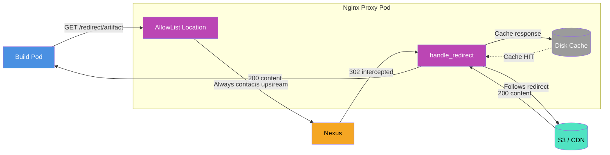
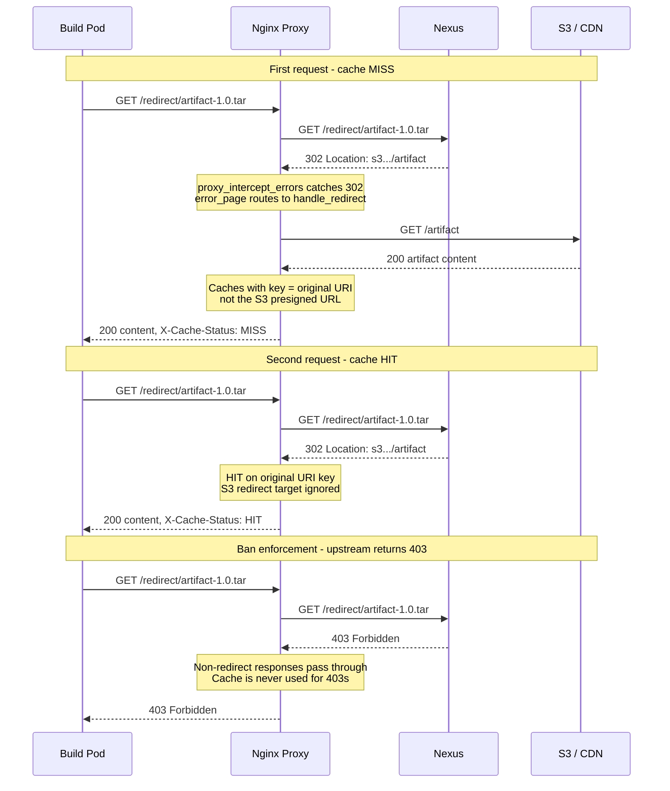

# Redirect Caching Architecture

## Overview

The nginx proxy layer intercepts HTTP redirects from upstream registries (e.g., Nexus) and follows them internally, caching the resulting content on disk. Build pods receive artifact content directly (`200`) instead of redirect responses (`302`).

## Request Flow

## Cache Miss vs Cache Hit

## Key Design Decisions

- **Cache key is the original request URI**, not the redirect target. S3 presigned URLs
  are ephemeral and unique per request, so keying on them would result in zero cache hits.

- **Upstream is always contacted.** AllowList locations never serve directly from cache,
  ensuring authorization and bans (403) are always enforced by Nexus.

- **Nginx follows redirects internally.** Clients see `200` with content, never `302`.
  Handled via `proxy_intercept_errors` and `error_page 301 302 307 308 = @handle_redirect`.

- **Dogpile protection.** `proxy_cache_lock on` ensures only one request fetches from S3
  when multiple concurrent requests arrive for the same uncached artifact.

- **Stale serving.** `proxy_cache_use_stale` serves cached content when S3 is temporarily
  unavailable.

## Cache Configuration

| Setting | Chart Default | Production | Description |
|---------|---------------|------------|-------------|
| `nginx.cache.ttl` | `1d` | `30d` | How long cached responses are considered fresh |
| `nginx.cache.size` | `1024` MiB | `1024` MiB | Maximum disk cache size |
| `inactive` | `7d` (hardcoded) | `7d` | Evict items not accessed within this period |
| `nginx.cache.allowList` | `[]` | configured | URL patterns routed through redirect caching |

> **Note:** Even with a 30-day TTL, items not accessed for 7 days are evicted due to the
> hardcoded `inactive=7d` setting in the nginx ConfigMap.
